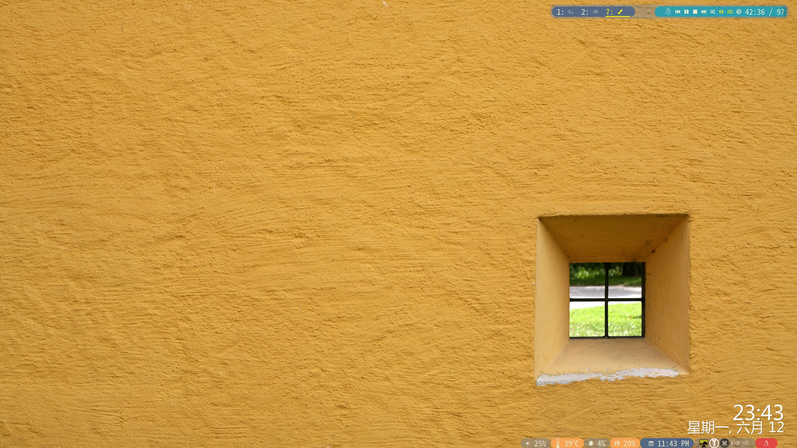
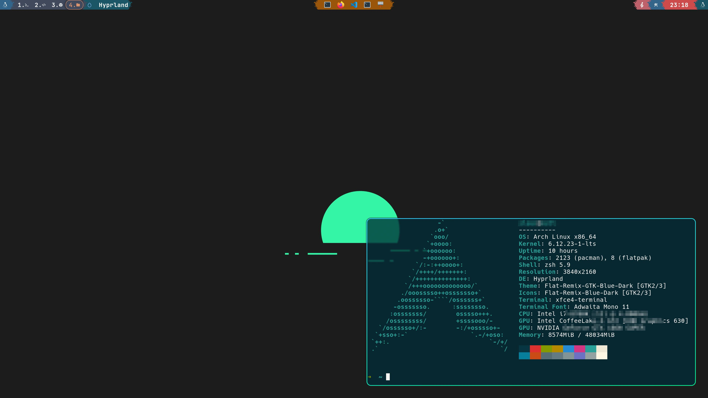

# dotfiles
> Arch Linux 快速配置工具： 目前支持 i3wm / hyprland 快速配置。
> 


## 快速安装


<details>
<summary>安装I3wm-点击展开</summary>


使用 curl 或者 wget 命令快速下载 `i3config`命令:
```
#wget -O i3config https://raw.githubusercontent.com/switchToLinux/dotfiles/main/i3config

curl -L -o i3config https://raw.githubusercontent.com/switchToLinux/dotfiles/main/i3config

chmod +x i3config

./i3config

```


`i3config`已经验证可用的 Linux发行版:
- [debian 12](https://www.debian.org/)
- [fedora 38](https://fedoraproject.org/)
- [openSUSE leap 15.5](https://get.opensuse.org/leap/)
- [Arch Linux](https://archlinux.org/)
- [Ubuntu](https://www.ubuntu.com)


系统信息

|Distro|[Arch Linux](https://archlinux.org/)|
|:---:|:---:|
|WM|[i3wm](https://github.com/i3/i3)|
|DM|[lightdm](https://github.com/canonical/lightdm)|
|Bar|[Polybar](https://github.com/polybar/polybar)|
|Menu|[Rofi](https://github.com/davatorium/rofi)-[rofi-themes](https://github.com/adi1090x/rofi)|
|Compositor|[Picom](https://github.com/yshui/picom)|
|Terminal|[konsole](https://konsole.kde.org) / [kitty](https://sw.kovidgoyal.net/kitty/) / [xfce4-terminal](https://gitlab.xfce.org/apps/xfce4-terminal) |
|Widgets|[eww,ElKowars wacky widgets](https://github.com/elkowar/eww)|
|Music/Player|[mpd](https://github.com/MusicPlayerDaemon/MPD)-[ncmpcpp](https://github.com/ncmpcpp/ncmpcpp)|
|File Manager|[Thunar](https://gitlab.xfce.org/xfce/thunar)|
|Terminal File Manager|[ranger](https://github.com/ranger/ranger) written in Python/ [yazi](https://github.com/sxyazi/yazi) written in Rust.|
|Shell|[Zsh](https://www.zsh.org/)-[oh-my-zsh](https://ohmyz.sh/)|
|wallpaper| [feh](https://github.com/derf/feh)-[variety](https://github.com/varietywalls/variety)|
|Xresources-themes| [Xresources-themes](https://github.com/janoamaral/Xresources-themes)|
|clipboard| [clipmenu](https://github.com/cdown/clipmenu) |
|locker| [i3lock-color](https://github.com/Raymo111/i3lock-color)|
|screensaver| [XScreenSaver](https://www.jwz.org/xscreensaver)|
|audio| [pulseaudio](https://www.freedesktop.org/wiki/Software/PulseAudio/) |


> i3wm 推荐编译源码版本，通常自带版本比较低，有些新功能不支持.
> 
> eww是一个适用于所有wm的组件,可以定制一些小组件功能，但对于不同分辨率切换有些让人头疼.
>
> variety可以动态设置壁纸，但它底层还是依赖feh 的。
>
> 也许给i3wm再添加个屏保更有趣一点，我们就选择使用 `XScreenSaver` 作为屏保程序，这个比之前使用的`xautolock`更有趣一些，内置了很多的动画效果。

</details>

<details>
<summary>安装Hyprland-点击展开</summary>
使用 curl 或者 wget 命令快速下载 `wconfig`命令:

```bash
# wget -O wconfig https://raw.githubusercontent.com/switchToLinux/dotfiles/main/wconfig
curl -L -o wconfig https://raw.githubusercontent.com/switchToLinux/dotfiles/main/wconfig

chmod +x wconfig

./wconfig

```

`wconfig`已经验证可用的 Linux发行版:
- [Arch Linux系列](https://archlinux.org/)

> wconfig 命令还在开发中，目前只支持Arch Linux系列，后续会支持更多的Linux发行版。

</details>


## TODO

<details>
  <summary>点击展开内容</summary>

- [x] 配置i3wm文件
- [x] 集成 polybar_themes 项目到 i3wm环境
- [x] 配置 picom 合成器，优化透明效果
- [x] 配置 mpd 音乐播放器(编译源码安装mpd过程问题较多，暂自行安装 mpd/mpc/ncmpcpp)
- [x] 配置 ncmpcpp 音乐播放器客户端
- [x] 配置 ranger 文件浏览器
- [ ] 集成 `Eww` 配置("平替"polybar_themes)，`Eww`支持`X11`和`Wayland`协议。
- [x] 配置 dunst 通知管理
- [x] 配置 rofi 启动器
- [x] 配置 ~/.Xresources 主题
- [x] 配置 rofi 主题(包含启动器、小插件和powermenu)
- [x] 锁屏工具选择`i3lock-color`版本替换原有的i3lock
- [ ] rofi主题优化，自适应分辨率(字体大小、布局)
- [ ] 实现锁屏切换选择，可选 xscreensaver /i3lock / betterlockscreen 等等可用锁屏软件
- [x] 支持 `ArchLinux` / `Manjaro` 发行版的软件编译安装及配置
- [x] i3wm 浮动视频小窗口的位置动态根据屏幕分辨率调整
- [x] 支持选择 lightdm/sddm/gdm等不同的显示管理器安装与切换
- [ ] 支持根据不同显示管理器的主题切换功能
- [x] 支持定制`firefox`页面主题`userChrome.css`
- [ ] 增加[polybar-scripts](https://github.com/polybar/polybar-scripts)的支持
- [x] 动态背景(视频或屏保效果)设置实现(`i3wall`)

</details>


## 预览效果

<details>
<summary>i3wm-点击展开</summary>



</details>

<details>
<summary>hyprland-点击展开</summary>



</details>


## 鸣谢

本项目只是聚合菜单工具，将其他作者开发的项目融合在一起，并且提供自动编译安装模块，方便用户使用和少出错。

在此，感谢本项目所使用的相关项目作者！感谢开源社区！
